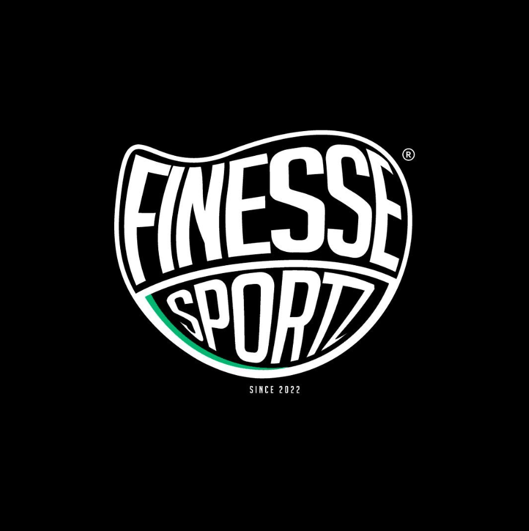

# Finesse Sportz - Sistema Web de Venda e Personalizacao de Camisas Esportivas

[](#status-final)
[](#informacoes-do-autor)
[](CodigosPlantUML)
[](LICENSE)

<div align="center">
  
</div>

---

## Resumo do Projeto

**Finesse Sportz** e um sistema web projetado para uma empresa ficticia de camisas esportivas. A solucao permite venda de camisas prontas, personalizacao com nome e numero, controle de estoque por variacao, processamento de pagamentos, acompanhamento de pedidos e administracao do catalogo.

O projeto foi desenvolvido como trabalho final de **Projeto de Software**, com foco em regras de negocio, requisitos, arquitetura, fluxos de comunicacao e diagramas UML em PlantUML.

---

## Informacoes do Autor

- **Autor**: Arthur
- **Instituicao**: Trabalho Final - Projeto de Software
- **Tema**: Empresa de camisas esportivas
- **Sistema**: Finesse Sportz
- **Versao Atual**: 1.0

---

## Problema e Escopo

### Enunciado do Problema

Empresas que vendem camisas esportivas precisam lidar com produtos que possuem muitas variacoes, como tamanho, cor, time, modelo e disponibilidade em estoque. Alem disso, camisas personalizadas exigem controle especifico de producao, pagamento e cancelamento.

O sistema deve resolver os seguintes pontos:

1. **Controle de estoque** - evitar venda de tamanho, cor ou modelo indisponivel.
2. **Personalizacao confiavel** - permitir nome e numero respeitando regras de negocio.
3. **Pagamento seguro** - confirmar pedidos somente apos aprovacao.
4. **Acompanhamento de pedido** - permitir que cliente acompanhe cada etapa.
5. **Gestao administrativa** - permitir cadastro de produtos, variacoes, estoque, cupons e relatorios.
6. **Documentacao clara** - apresentar arquitetura, requisitos e diagramas PlantUML.

### Requisitos Principais

#### Funcionais

- Clientes podem se cadastrar e fazer login.
- Clientes podem consultar catalogo de camisas esportivas.
- Clientes podem filtrar produtos por time, modalidade, tamanho, cor e preco.
- Clientes podem personalizar camisa com nome e numero.
- Clientes podem adicionar itens ao carrinho e finalizar pedido.
- O sistema deve calcular desconto, frete, subtotal e total.
- O sistema deve validar estoque antes da compra.
- O sistema deve processar pagamento por gateway externo simulado.
- Administradores podem gerenciar produtos, variacoes e estoque.
- Administradores podem acompanhar pedidos e gerar relatorios.

#### Nao Funcionais

- O sistema deve ser responsivo para desktop e dispositivos moveis.
- A API deve responder rapidamente em operacoes comuns.
- As senhas devem ser armazenadas com hash seguro.
- Rotas administrativas devem exigir permissao de administrador.
- O sistema deve registrar logs de operacoes criticas.
- O banco de dados deve manter integridade referencial.
- Os diagramas devem ser criados com PlantUML.

---

## Arquitetura Geral

A proposta segue uma arquitetura distribuida, baseada em API Gateway e microsservicos. Essa estrutura foi escolhida para ficar alinhada ao trabalho de referencia e para separar melhor as responsabilidades do dominio.

```text
+------------------------------------------------------------+
|                   Frontend Web - React SPA                 |
|        Catalogo, carrinho, checkout e painel admin          |
+-----------------------------+------------------------------+
                              |
                              v
+------------------------------------------------------------+
|                  API Gateway / BFF                         |
|        Autenticacao, roteamento, seguranca e logs           |
+------+------------+-------------+-------------+------------+
       |            |             |             |
       v            v             v             v
+-------------+ +------------+ +------------+ +-------------+
| Catalogo    | | Pedidos    | | Pagamento  | | Estoque     |
| Service     | | Service    | | Service    | | Service     |
+------+------+ +-----+------+ +-----+------+ +------+------+
       |              |              |               |
       v              v              v               v
   [DB Catalogo]  [DB Pedidos]  [Gateway Pay]   [DB Estoque]

+------------------------------------------------------------+
|             Notification Service / Email Service           |
+------------------------------------------------------------+
```

### Microsservicos

| Servico | Responsabilidade | Tecnologia Proposta |
|---|---|---|
| **Auth Service** | Login, cadastro, perfis e tokens JWT. | Spring Boot + JWT |
| **Catalogo Service** | Produtos, times, modalidades e variacoes. | Spring Boot + PostgreSQL |
| **Estoque Service** | Quantidades, reservas e alertas de estoque baixo. | Spring Boot + PostgreSQL |
| **Pedidos Service** | Carrinho, pedidos, status e regras de cancelamento. | Spring Boot + PostgreSQL |
| **Pagamento Service** | Integracao com gateway de pagamento simulado. | Spring Boot + REST |
| **Notification Service** | Confirmacoes de pedido, envio e cancelamento. | Spring Boot + Email |
| **Relatorio Service** | Indicadores de vendas, produtos e estoque. | Spring Boot + PostgreSQL |

---

## Fluxo Principal: Pedido e Pagamento

### 10 Fases Detalhadas

```text
1. Autenticacao
   Cliente faz login ou cadastro.

2. Navegacao no Catalogo
   Cliente consulta camisas e aplica filtros.

3. Selecao da Camisa
   Cliente escolhe produto, tamanho e cor.

4. Personalizacao
   Cliente informa nome e numero, se desejar.

5. Verificacao de Estoque
   Sistema valida disponibilidade da variacao.

6. Criacao do Carrinho
   Item e adicionado com preco base e acrescimos.

7. Fechamento do Pedido
   Sistema calcula subtotal, desconto, frete e total.

8. Reserva de Estoque
   Quantidade fica reservada durante o pagamento.

9. Processamento de Pagamento
   Gateway aprova ou recusa a transacao.

10. Confirmacao e Producao
    Pedido aprovado segue para separacao ou producao personalizada.
```

### Fluxo de Cancelamento

O sistema tambem suporta cancelamento com regras especificas:

- pedido comum pode ser cancelado antes do envio;
- pedido personalizado nao pode ser cancelado apos entrar em producao;
- pagamento aprovado pode gerar estorno quando o cancelamento for permitido;
- estoque reservado deve ser liberado quando o pedido for cancelado;
- cliente deve ser notificado sobre o resultado.

---

## Estrutura do Repositorio

```text
Trabalho Final - Projeto de Software/
|
|-- README.md
|-- LICENSE
|-- CONTRIBUTING.md
|-- .gitignore
|
|-- CodigosPlantUML/
|   |-- README.md
|   |-- actors.puml
|   |-- use_cases.puml
|   |-- architecture.puml
|   |-- components.puml
|   |-- classes.puml
|   |-- diagrama_comunicacao_fluxo_completo.puml
|   |-- diagrama_sequencia_pedido_pagamento.puml
|   |-- estados.puml
|   |-- diagrama_entidade_relacionamento.puml
|   `-- implantacao.puml
|
|-- Problema/
|   `-- problema-finesse-sportz.md
|
|-- Relatorio/
|   `-- relatorio-finesse-sportz.md
|
`-- docs/
    |-- regras-de-negocio.md
    |-- requisitos.md
    |-- arquitetura.md
    |-- api-endpoints.md
    |-- assets/
    |   `-- finessepreto.png
    `-- diagramas/
```

---

## 10 Diagramas UML Completos

### Diagramas de Analise

1. **Atores** (`actors.puml`) - usuarios, administradores e sistemas externos.
2. **Casos de Uso** (`use_cases.puml`) - funcionalidades principais do sistema.
3. **Fluxo de Comunicacao** (`diagrama_comunicacao_fluxo_completo.puml`) - interacoes entre atores e servicos.

### Diagramas de Projeto

4. **Arquitetura** (`architecture.puml`) - visao geral em camadas e servicos.
5. **Componentes** (`components.puml`) - detalhamento dos microsservicos.
6. **Classes** (`classes.puml`) - entidades principais do dominio.
7. **Sequencia de Pedido** (`diagrama_sequencia_pedido_pagamento.puml`) - fluxo detalhado de compra.
8. **Estados** (`estados.puml`) - maquina de estados do pedido.

### Diagramas de Implementacao

9. **Entidade-Relacionamento** (`diagrama_entidade_relacionamento.puml`) - modelo relacional proposto.
10. **Implantacao** (`implantacao.puml`) - ambiente de deploy planejado.

---

## Tecnologias e Stack

### Backend

```text
Framework:      Spring Boot 3.x
Linguagem:      Java 17
Seguranca:      Spring Security + JWT
Persistencia:   Spring Data JPA
Validacao:      Bean Validation
```

### Frontend

```text
Web:            React 18
Linguagem:      TypeScript
Build:          Vite
Estilo:         Tailwind CSS
HTTP:           Axios
Rotas:          React Router
```

### Banco de Dados

```text
Principal:      PostgreSQL 16
Migracoes:      Flyway
Modelo:         Relacional
```

### Comunicacao

```text
API:            REST
Autenticacao:   Bearer Token JWT
Eventos:        Mensageria simulada para notificacoes
```

### Infraestrutura

```text
Containers:     Docker
Orquestracao:   Docker Compose
Deploy:         Render, Railway ou VPS
Versionamento:  Git + GitHub
```

---

## Estatisticas do Projeto

| Item | Quantidade |
|---|---:|
| Diagramas PlantUML principais | 10 |
| Requisitos funcionais documentados | 17 |
| Requisitos nao funcionais documentados | 8 |
| Regras de negocio documentadas | 20 |
| Microsservicos propostos | 7 |
| Entidades principais | 10 |

---

## Diagramas Principais

### 1. Diagrama de Componentes

Arquivo: [CodigosPlantUML/components.puml](./CodigosPlantUML/components.puml)

Mostra os modulos internos de cada microsservico, como controllers, services, repositories e integracoes.

### 2. Diagrama de Implantacao

Arquivo: [CodigosPlantUML/implantacao.puml](./CodigosPlantUML/implantacao.puml)

Mostra uma proposta de deploy com frontend, API Gateway, backend, banco de dados e gateway de pagamento.

### 3. Diagrama de Comunicacao

Arquivo: [CodigosPlantUML/diagrama_comunicacao_fluxo_completo.puml](./CodigosPlantUML/diagrama_comunicacao_fluxo_completo.puml)

Mostra como cliente, frontend, gateway, servicos e banco interagem durante o processo de compra.

### 4. Diagrama de Estados

Arquivo: [CodigosPlantUML/estados.puml](./CodigosPlantUML/estados.puml)

Mostra os estados possiveis de um pedido, desde a criacao ate entrega ou cancelamento.

---

## Padroes de Design Implementados

### Arquiteturais

- API Gateway para centralizar entrada das requisicoes.
- Service Layer para concentrar regras de negocio.
- Repository para isolar acesso a dados.
- DTO para entrada e saida de dados na API.

### Comunicacao

- REST para comunicacao sincrona.
- Webhook para retorno do gateway de pagamento.
- Eventos simulados para notificacoes.

### Dados

- Modelo relacional para pedidos, produtos, pagamentos e estoque.
- Controle de integridade por chaves estrangeiras.
- Separacao de entidades por contexto de negocio.

### Seguranca

- Autenticacao JWT.
- Controle de perfil Cliente/Admin.
- Hash de senha.
- Protecao de rotas administrativas.

---

## Como Usar Este Repositorio

### Para Desenvolvedores

1. Ler o README.
2. Consultar os requisitos em [docs/requisitos.md](./docs/requisitos.md).
3. Consultar as regras em [docs/regras-de-negocio.md](./docs/regras-de-negocio.md).
4. Usar os diagramas PlantUML como guia de implementacao.

### Para Analise de Requisitos

1. Comecar pelo arquivo [Problema/problema-finesse-sportz.md](./Problema/problema-finesse-sportz.md).
2. Conferir requisitos funcionais e nao funcionais.
3. Validar regras de negocio.
4. Revisar casos de uso.

### Para Arquitetura

1. Abrir [CodigosPlantUML/architecture.puml](./CodigosPlantUML/architecture.puml).
2. Abrir [CodigosPlantUML/components.puml](./CodigosPlantUML/components.puml).
3. Conferir o relatorio em [Relatorio/relatorio-finesse-sportz.md](./Relatorio/relatorio-finesse-sportz.md).

---

## Checklist de Conformidade

### Requisitos Funcionais

- [x] Cadastro e login de clientes.
- [x] Catalogo de produtos.
- [x] Personalizacao de camisas.
- [x] Carrinho e pedido.
- [x] Pagamento.
- [x] Controle de estoque.
- [x] Painel administrativo.
- [x] Relatorios.

### Requisitos Nao Funcionais

- [x] Seguranca.
- [x] Responsividade.
- [x] Integridade dos dados.
- [x] Documentacao.
- [x] Arquitetura definida.
- [x] Diagramas PlantUML.

### Qualidade do Projeto

- [x] Problema documentado.
- [x] Escopo definido.
- [x] Regras de negocio listadas.
- [x] Diagramas organizados.
- [x] Estrutura inspirada no trabalho de referencia.

---

## Proximos Passos

1. Revisar dados do autor e contato.
2. Gerar imagens PNG dos diagramas PlantUML, se necessario.
3. Transformar o relatorio Markdown em PDF ou DOCX, se o professor exigir.
4. Ajustar regras de negocio conforme feedback.
5. Criar prototipo de telas, caso a entrega peca demonstracao visual.

---

## Documentacao Adicional

- [Regras de Negocio](./docs/regras-de-negocio.md)
- [Requisitos](./docs/requisitos.md)
- [Arquitetura](./docs/arquitetura.md)
- [Mapa de Endpoints](./docs/api-endpoints.md)
- [Codigos PlantUML](./CodigosPlantUML)
- [Problema](./Problema/problema-finesse-sportz.md)
- [Relatorio](./Relatorio/relatorio-finesse-sportz.md)

---

## Contato

- **Autor**: Arthur
- **Projeto**: Finesse Sportz
- **Finalidade**: Trabalho Final de Projeto de Software

---

## Licenca

Este projeto academico esta disponivel sob a licenca MIT.

---

## Status Final

Documentacao inicial concluida e estruturada com base no trabalho de referencia indicado.
